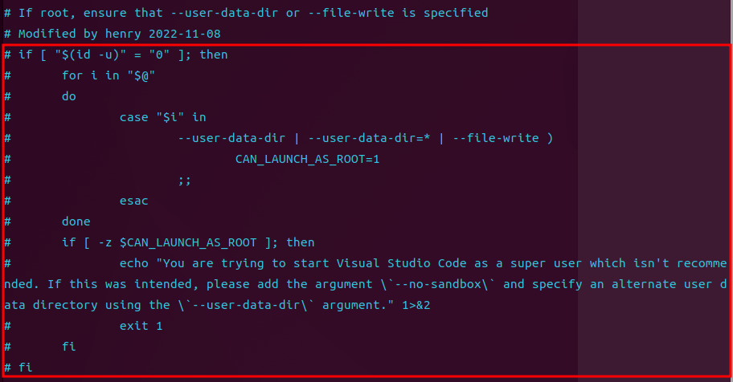
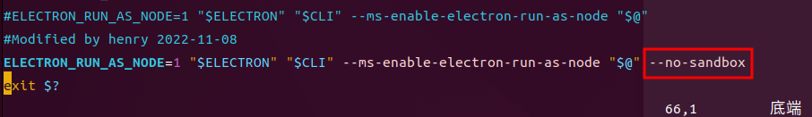

```
Q: 无法以root用户打开vsocde
A: 命令行输入 code . --no-sandbox --user-data-dir='/path/to/data-dir'；或将该命令写入到 ~/.bashrc中。但缺点是，通过命令行打开，无法关闭该命令行
```

上述缺点解决：
修改 /usr/share/code/bin/code，作如下修改：
1、将这一段完全注释掉，无视root用户检查。

2、将启动命令加上 --no-sandbox 参数

<code>ELECTRON_RUN_AS_NODE=1 "$ELECTRON" "$CLI" --ms-enable-electron-run-as-node "$@" --no-sandbox</code>
3、将 ~/.zshrc 和 ~/.bashrc 中的 code 命令别名去掉

4、上述修改完成后，依然无法通过点开图标的方式打开vscode，但仍然可以用命令行的 <code>code</code> 命令打开，而且打开后可以关掉终端。